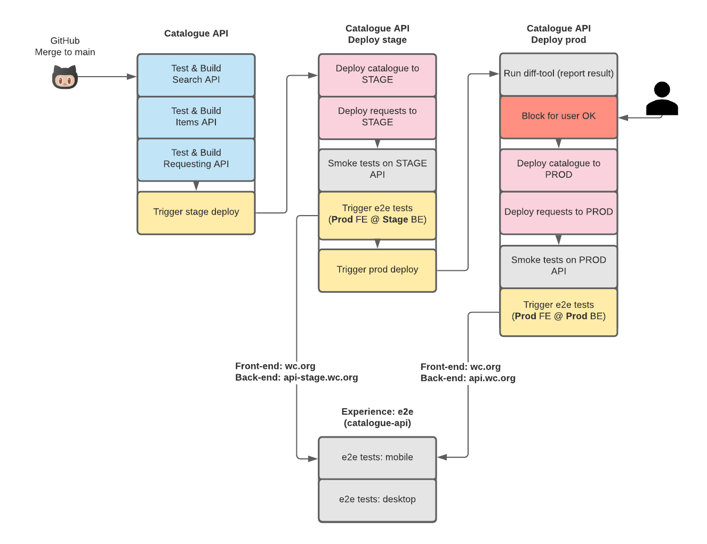

# Catalogue API

All the services that make up the Catalogue API

## Overview

Contains the Catalogue APIs for search, snapshot, requesting and attendant ECS Script Tasks.

## Deploying

We deploy ECS catalogue services using the [weco-deploy](https://github.com/wellcomecollection/weco-deploy) tool.

### Continuous integration

The [current latest default branch](https://buildkite.com/wellcomecollection/catalogue-api) build [deploys to staging automatically](https://buildkite.com/wellcomecollection/catalogue-api-deploy-stage). 

After a deployment to stage environment, we run [smoke tests](smoke_tests/README.md) against the stage API and then [e2e tests](https://github.com/wellcomecollection/wellcomecollection.org/blob/main/playwright/README.md) on the front-end pointing the production wellcomecollection.org at the stage catalogue API.

After a successful stage deployment we run the [diff_tool](diff_tool/README.md) and wait for a user to review and [deploy to production](https://buildkite.com/wellcomecollection/catalogue-api-deploy-prod).

We then run the same smoke & e2e tests pointed at production to confirm a successful deployment.

The CI flow looks as follows:

## Dependencies

* Java 1.8
* Scala 2.12
* SBT
* Terraform
* Docker
* Make
