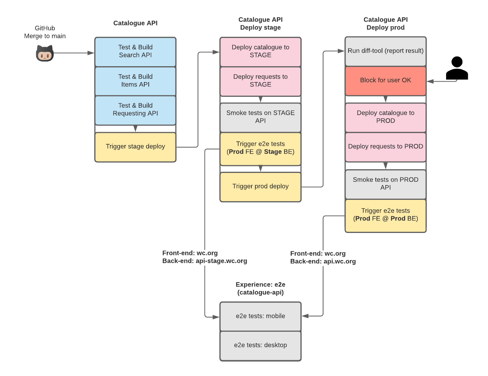

### Continuous integration

The [current latest default branch](https://buildkite.com/wellcomecollection/catalogue-api) build [deploys to staging automatically](https://buildkite.com/wellcomecollection/catalogue-api-deploy-stage).

After a deployment to stage environment, we run [smoke tests](smoke_tests/README.md) against the stage API and then [e2e tests](https://github.com/wellcomecollection/wellcomecollection.org/blob/main/playwright/README.md) on the front-end pointing the production wellcomecollection.org at the stage catalogue API.

After a successful stage deployment we run the [diff_tool](diff_tool/README.md) and wait for a user to review and [deploy to production](https://buildkite.com/wellcomecollection/catalogue-api-deploy-prod).

We then run the same smoke & e2e tests pointed at production to confirm a successful deployment.

The CI flow looks as follows:



## Dependencies

- Java 11
- Scala 2.12
- SBT
- Terraform
- Docker
- Make

### Installing dependencies

We suggest using [SDKMAN](https://sdkman.io/) to manage Java versions. It can be installed with:

```bash
curl -s "https://get.sdkman.io" | bash
source "$HOME/.sdkman/bin/sdkman-init.sh"
```

Then install Java 11 with:

```bash
sdk install java 11.0.24-amzn
```

At the root of the project you should be able to use `sbt` to run the project as described below.

## Running locally

Currently only the search & items API can be run locally. It will use the configured pipeline index in
[`ElasticConfig.scala`](../common/search/src/main/scala/weco/api/search/models/ElasticConfig.scala).

By default the apps run in dev mode (the default `api.public-root` in
[`application.conf`](../search/src/main/resources/application.conf) points at `api-dev.wellcomecollection.org`),
where they read Elasticsearch secrets using the `catalogue-developer` AWS profile.
You will need valid credentials for that profile. If `catalogue-developer` is a
role-assumption profile (`role_arn` with a `source_profile`), log in to SSO on its
source profile, e.g.:

```bash
aws sso login
```

If instead you have `catalogue-developer` configured as an SSO profile itself, use
`aws sso login --profile catalogue-developer`.

To run the search API from the root of the repository:

```bash
sbt "project search" run
```

Or, to run with reloading of code changes using [`sbt-revolver`](https://github.com/spray/sbt-revolver):

```bash
sbt "project search" "~reStart"
AWS_PROFILE=catalogue-developer sbt "project items" "~reStart"
```

You should then be able to access the APIs at:

- `http://localhost:8080/works`: Search
- `http://localhost:8081/items`: Items

In dev mode the search API logs every request with its full query string, which is
useful for checking exactly what the front-end sends.

**Note:** `sbt` fails to load inside a git worktree (sbt-git/jgit throws
"Bare Repository has neither a working tree, nor an index"), so run it from a normal checkout.

To specify a different pipeline index, you can set the `pipelineDate` environment variable for the search API:

```bash
pipelineDate=2021-01-01 sbt "project search" "~reStart"
```

### Running tests locally

The search project's tests need an Elasticsearch instance on `localhost:9200`.
You can start one with the [`docker-compose.yml`](../search/docker-compose.yml) in the `search` directory
(this is the same Elasticsearch that CI starts via [`run_sbt_tests.sh`](../builds/run_sbt_tests.sh)):

```bash
(cd search && docker compose up -d)
sbt "project search" test
```
