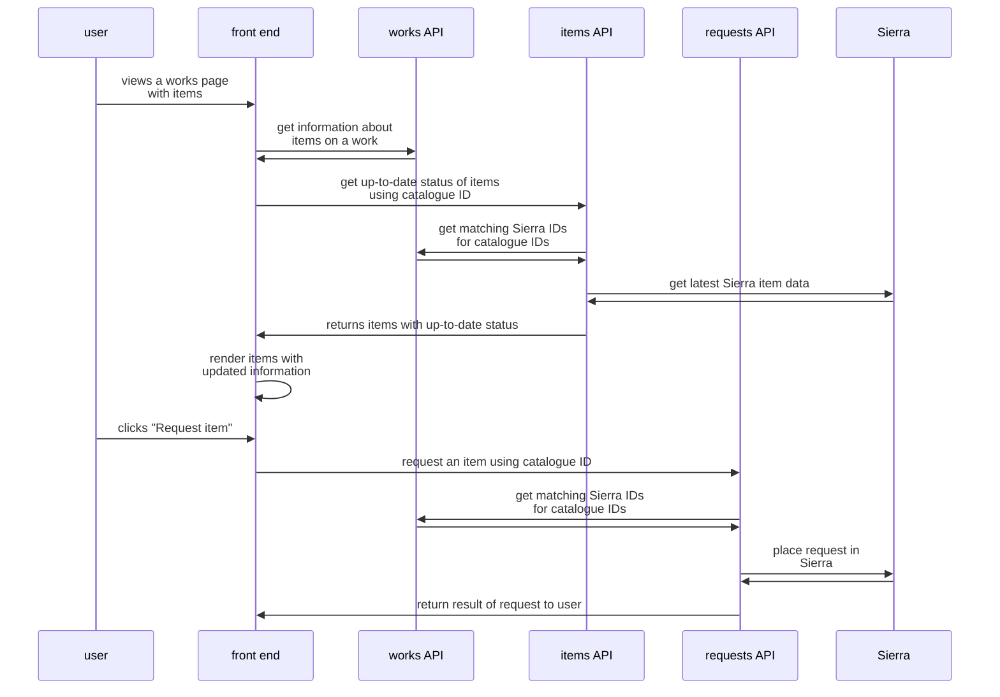

# How users request items

Users can use the website to request items to view in the library; we provide a series of APIs to help them do that.

This is what the flow looks like:

```mermaid
sequenceDiagram
     participant user
     participant front end
     participant works API
     participant items API
     participant requests API
     participant Sierra

     user->>front end: views a works page<br/> with items

     front end->>works API: get information about<br/>items on a work
     works API->>front end:

     front end->>items API: get up-to-date status of items<br/>using catalogue ID
     items API->>works API: get matching Sierra IDs<br/>for catalogue IDs
     works API->>items API:
     items API->>Sierra: get latest Sierra item data
     Sierra->>items API:
     items API->>front end: returns items with up-to-date status
     front end->>front end: render items with<br/>updated information

     user->>front end: clicks "Request item"
     front end->>requests API: request an item using catalogue ID
     requests API->>works API: get matching Sierra IDs<br/>for catalogue IDs
     works API->>requests API:
     requests API->>Sierra: place request in<br/>Sierra
     Sierra->>requests API:
     requests API->>front end: return result of request to user
```
