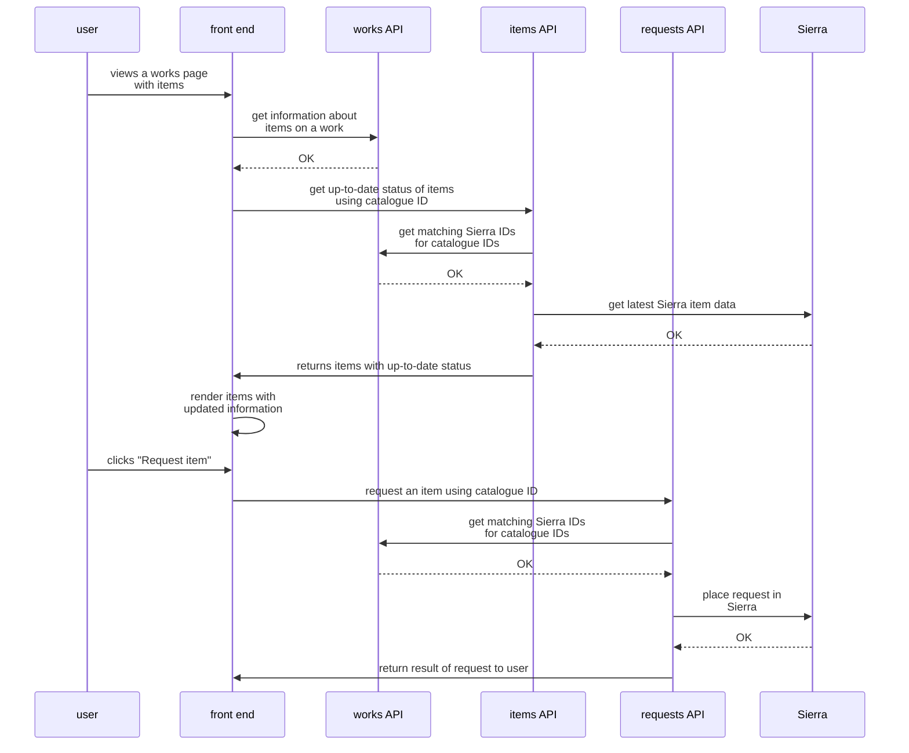

# How users request items

Users can use the website to request items to view in the library; we provide a series of APIs to help them do that.

This is what the flow looks like:

## Collection dates

The items API attaches an `availableDates` list to each requestable item. The front end shows these as the dates a
reader can choose to collect the item. The requests API records the date the reader picked in a note on the Sierra hold.
It rejects blocked collection dates (see below) but otherwise doesn't check that the date was one the items API offered.

The dates are worked out in `SierraItemUpdater` from the venue opening times in the Content API:

- **Library items** are offered from the next opening day. A request made before 10am can be collected the next opening
  day; a later request the day after that.
- **Deepstore items** take ten working days to arrive, then are offered on library opening days after that.

### Days when the library is closed

Mark the library as closed in Prismic. The Content API stops returning that day as an opening day, and the items API
stops offering it.

### Days when the library is open but items can't be collected

Add the date to `BlockedCollectionDates` in `common/stacks` and merge. Both services are redeployed on merge: the items
API removes the date from `availableDates` after the lead-time calculation, so it doesn't delay when an item becomes
available, and the requests API rejects a request for that date with a 400. Remove dates once they've passed.
