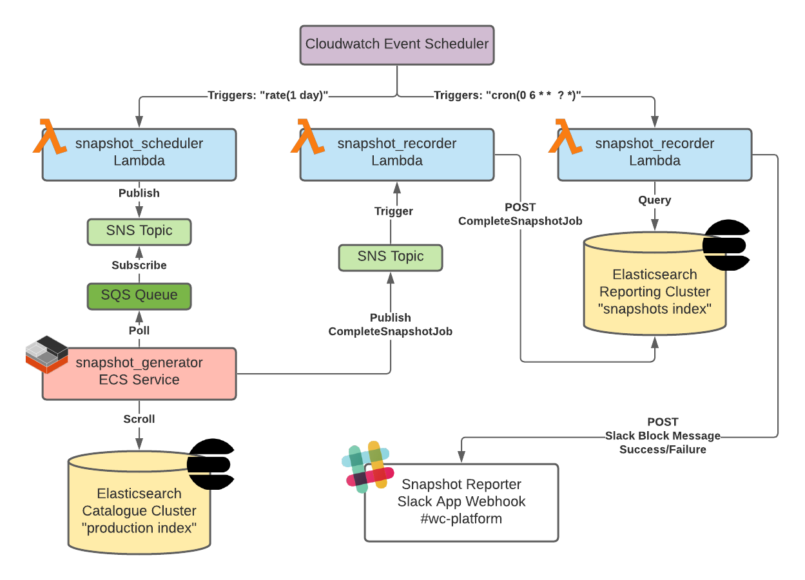

# snapshots

Services for creating, recording and reporting on Catalogue API snapshots.

## Overview

Contains:

- `snapshot_scheduler`: a lambda triggered by CloudWatch, publishes messages to SNS describing required snapshots.
- `snapshot_generator`: an ECS service which polls SQS, produces a snapshot of documents from the Catalogue ES indices using their display model.
- `snapshot_recorder`: a lambda triggered by SNS, recording metadata in a reporting cluster Elasticsearch index.
- `snapshot_reporter`: a lambda triggered by CloudWatch, reports on daily snapshots in team Slack, will provide notification on failure.

## Architecture



## Deployment

### Steps

The snapshot_generator is deployed alongside the catalogue API using Buildkite.

To upload a new Lambda deployment package:

```console
pip3 install --target ./src -r requirements.txt
cd src/
zip -r ../snapshot_<lambda_name>.zip .
cd ..
AWS_PROFILE=catalogue-dev aws s3 cp snapshot_<lambda_name>.zip s3://wellcomecollection-catalogue-infra-delta/lambdas/snapshots/snapshot_<lambda_name>.zip
```

## Running locally

To create a snapshot of a non-production index and save it to a separate S3 location, it is possible to run the
snapshot generator locally.

For example, to create a works snapshot and save it to `s3://wellcomecollection-data-public-delta/catalogue_dev/v2/works.json.gz`,
run the snapshot generator with the following environment variables:

```
SNAPSHOT_BUCKET_NAME="wellcomecollection-data-public-delta"
SNAPSHOT_BUCKET_KEY="catalogue_dev/v2/works.json.gz"
SNAPSHOT_INDEX="works-indexed-<SOME_INDEX_DATE>"
PIPELINE_DATE=<SOME_PIPELINE_DATE>
SNAPSHOT_QUERY='{"term": {"type": "Visible"}}'
AWS_PROFILE=catalogue-developer
AWS_REGION=eu-west-1
```
