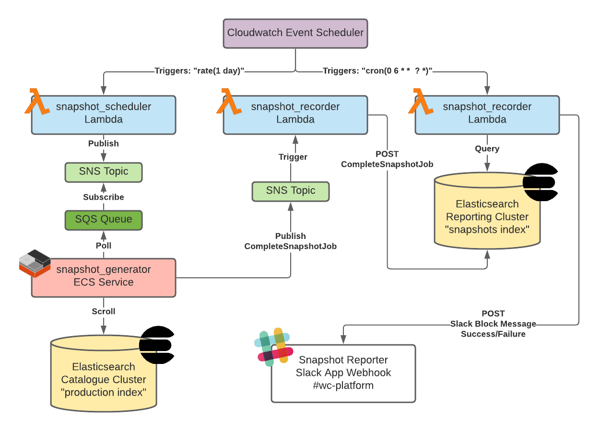

# snapshots

Services for creating, recording and reporting on Catalogue API snapshots.

## Overview

Contains:

- `snapshot_scheduler`: a lambda triggered by CloudWatch, publishes messages to SNS describing required snapshots.
- `snapshot_generator`: an ECS service which polls SQS, produces a snapshot of documents from the Catalogue ES indices using their display model.
- `snapshot_recorder`: a lambda triggered by SNS, recording metadata in a reporting cluster Elasticsearch index.
- `snapshot_reporter`: a lambda triggered by CloudWatch, reports on daily snapshots in team Slack, will provide notification on failure.

## Architecture



## Deployment

The `snapshot_generator` is an ECS service and is deployed alongside the catalogue API by the Buildkite prod pipeline.

The three lambdas (`snapshot_scheduler`, `snapshot_recorder` and `snapshot_reporter`) are not deployed by Buildkite. Each one loads its code from a versioned S3 object, and the lambda module deliberately ignores changes to that object version, so uploading a new zip does nothing on its own and `terraform apply` will not pick it up either. A deploy is a zip upload followed by `aws lambda update-function-code` pointing at the new object version.

### Building the package

The functions run Python 3.10 on x86_64, so build with wheels for that platform rather than for the machine you are on. Run this from the lambda's directory, for example `snapshots/snapshot_scheduler`:

```console
rm -rf build && mkdir -p build/pkg
cp src/*.py build/pkg/ && rm -f build/pkg/test_*.py
pip3 install --target build/pkg \
  --platform manylinux2014_x86_64 --only-binary=:all: \
  --implementation cp --python-version 3.10 \
  -r REQUIREMENTS
(cd build/pkg && zip -qr ../snapshot_LAMBDA_NAME.zip .)
```

`REQUIREMENTS` is `requirements.txt` for the recorder and reporter. For the scheduler it is `src/requirements.txt`: the top-level `requirements.txt` there is the test lockfile and adds moto and pytest, which should not be bundled.

### Uploading and updating the function

The bucket is versioned, so the upload returns the version to point the function at. The functions are named `snapshot_LAMBDA_NAME-prod`.

```console
export AWS_PROFILE=catalogue-developer AWS_REGION=eu-west-1
VERSION=$(aws s3api put-object \
  --bucket wellcomecollection-catalogue-infra-delta \
  --key lambdas/snapshots/snapshot_LAMBDA_NAME.zip \
  --body build/snapshot_LAMBDA_NAME.zip \
  --query VersionId --output text)
aws lambda update-function-code \
  --function-name snapshot_LAMBDA_NAME-prod \
  --s3-bucket wellcomecollection-catalogue-infra-delta \
  --s3-key lambdas/snapshots/snapshot_LAMBDA_NAME.zip \
  --s3-object-version "$VERSION"
aws lambda wait function-updated --function-name snapshot_LAMBDA_NAME-prod
```

Afterwards check the function's CloudWatch logs on its next scheduled run: the scheduler runs daily at 00:23 UTC and the reporter at 06:00 UTC on weekdays.

## Running locally

To create a snapshot of a non-production index and save it to a separate S3 location, it is possible to run the
snapshot generator locally.

For example, to create a works snapshot and save it to `s3://wellcomecollection-data-public-delta/catalogue_dev/v2/works.json.gz`,
run the snapshot generator with the following environment variables:

```
SNAPSHOT_BUCKET_NAME="wellcomecollection-data-public-delta"
SNAPSHOT_BUCKET_KEY="catalogue_dev/v2/works.json.gz"
SNAPSHOT_INDEX="works-indexed-<SOME_INDEX_DATE>"
PIPELINE_DATE=<SOME_PIPELINE_DATE>
SNAPSHOT_QUERY='{"term": {"type": "Visible"}}'
AWS_PROFILE=catalogue-developer
AWS_REGION=eu-west-1
```
